

---

## Overview

**NovaSound is a MERN (MongoDB, Express, React, Node.js) stack, Audio Sharing App developed as a personal project with React Native CLI.**

**NovaSound emerged from a profound intention—to honor and memorialize the memory of the Nova party on 7.10.23. This initiative seeks to commemorate the lives lost tragically during the 7.10 massacre at the Nova party in Israel.**

**Throughout this project I delved into advanced concepts, enriching my expertise while intertwining modern technology with heartfelt remembrance. Beyond its core purpose, NovaSound represents the fusion of sophisticated audio sharing within a robust application, aspiring to immortalize the spirit of the party and honor the individuals whose presence was cherished but tragically cut short.**

## Video Showcase
[Watch a Video Demonstration of the App](https://www.youtube.com/watch?v=oHhNUf1BDEE)

---

| Technologies Used               | Features                        |
|--------------------------------|---------------------------------|
| React Native CLI                | Background audio player         |
| Redux Toolkit                   | Seamless audio streaming        |
| Node.js                         | Playback controls and options   |
| Express                         | Intuitive user interface        |
| MongoDB                         | Efficient data handling         |
| TypeScript                      | Speed control for music         |
| Mailtrap                        | Notifications                   |
| React Query                     | Email Authentication            |
| Android Studio                  | Email Verification              |
| Aggregation                     | Audio file upload with poster   |
| Cloudinary                      | Profile handling with           |
| JSON Web Token (JWT)            | Audio histories                 |

---
## Note: 

**This project is primarily focused on the Android platform due to development constraints arising from not having access to a Mac computer, necessary for iOS app development with CLI.**

## Pictures:

### `App:`

  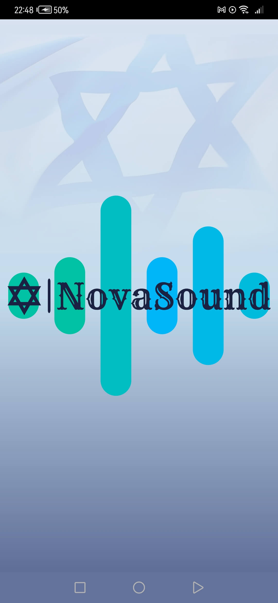
  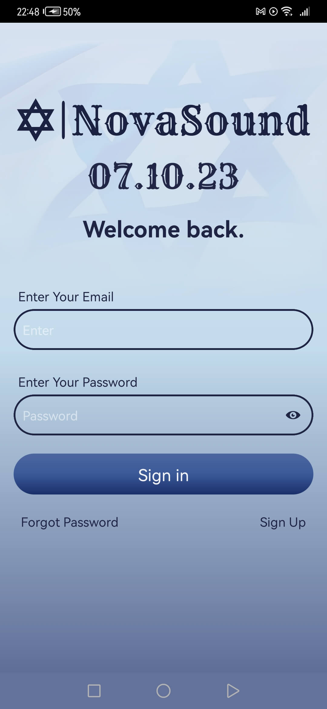
  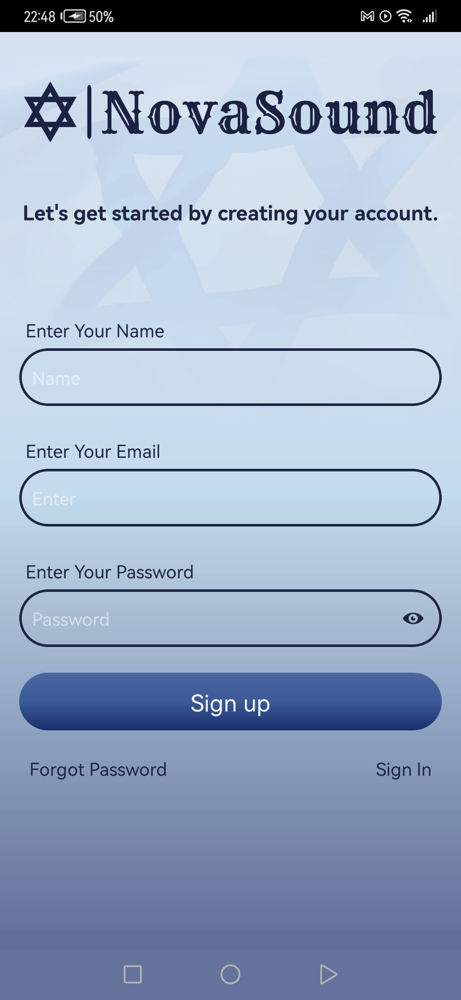
  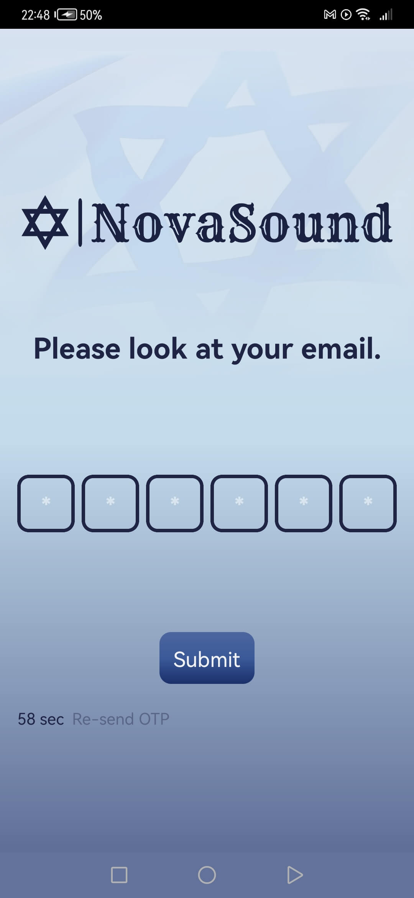
  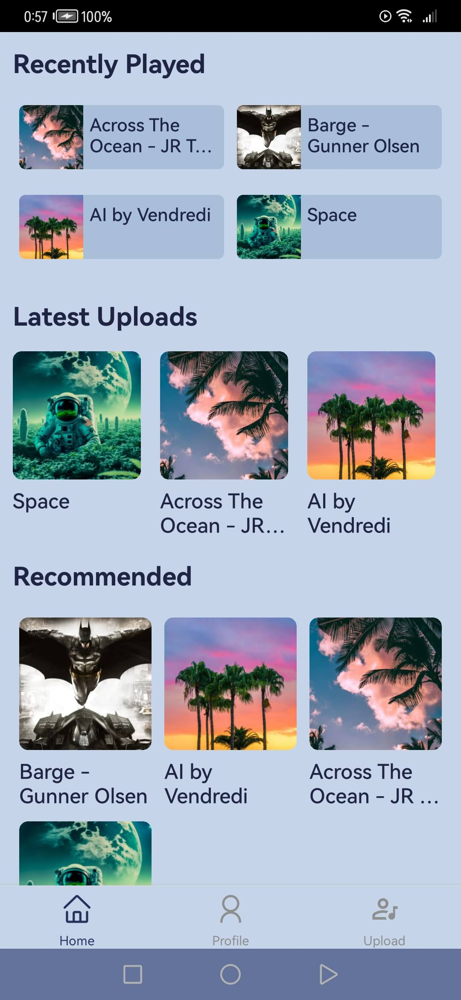
  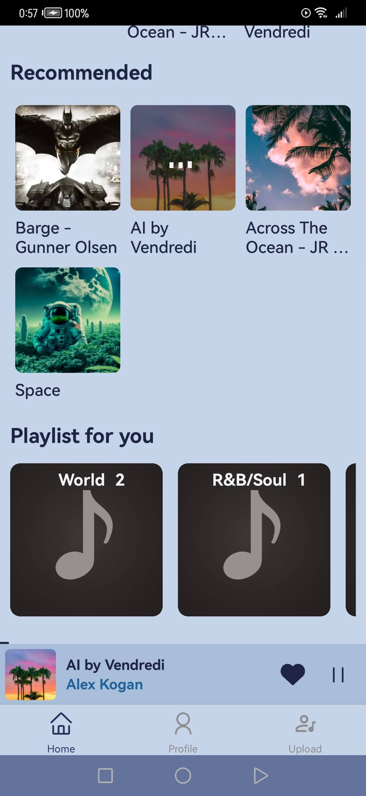
  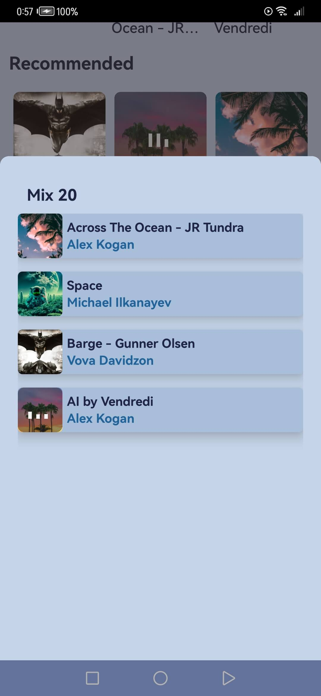
  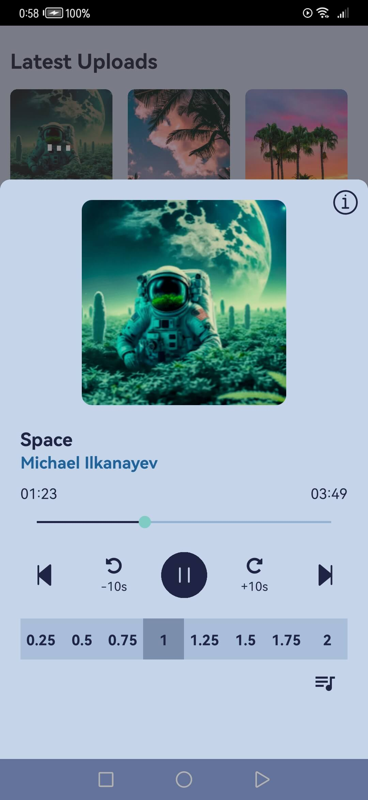
  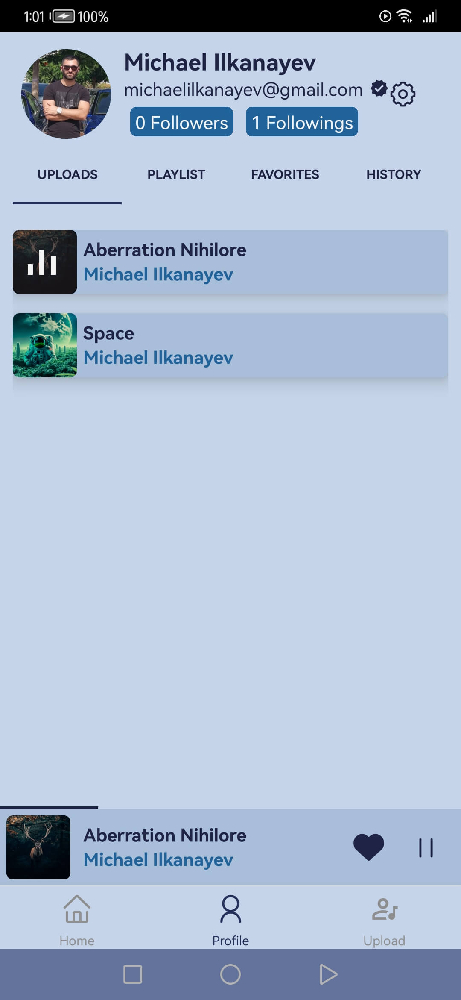
  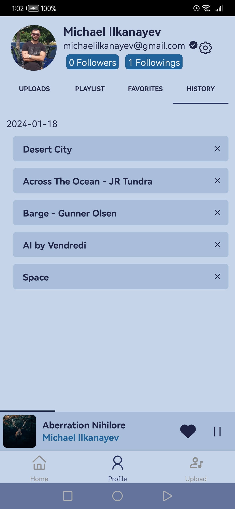
  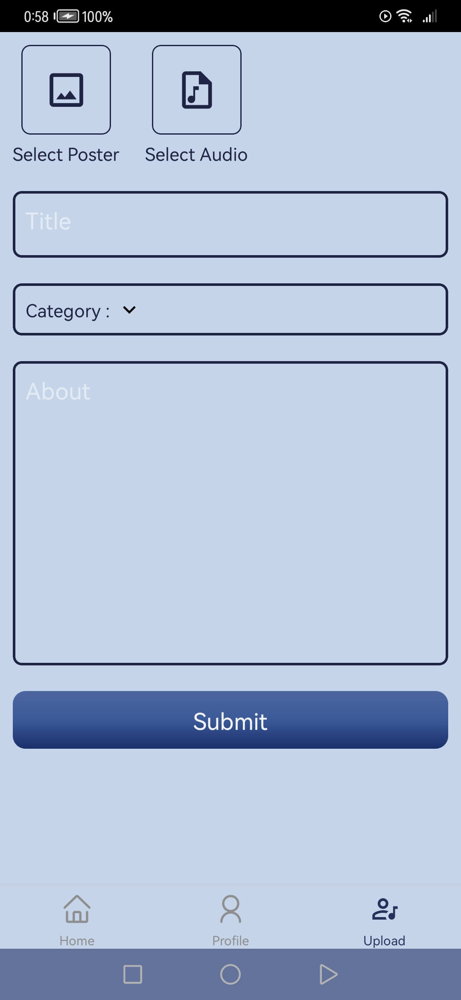
  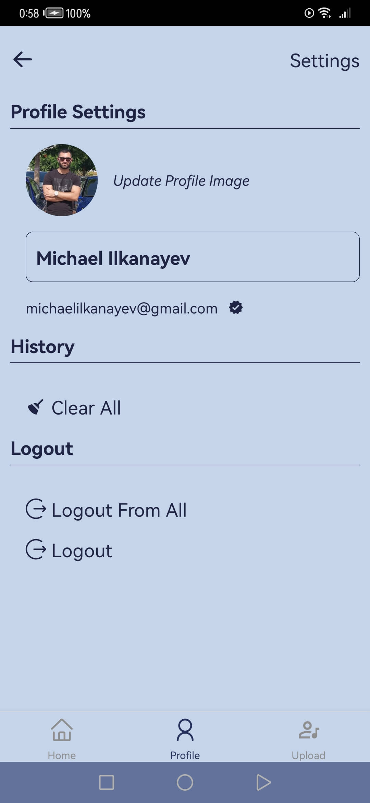
  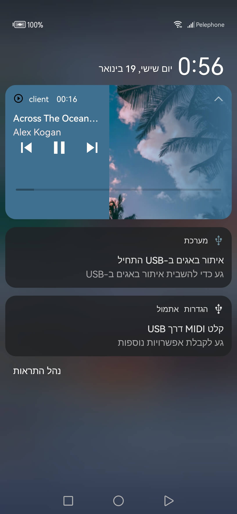

### `Mail Trap:`
  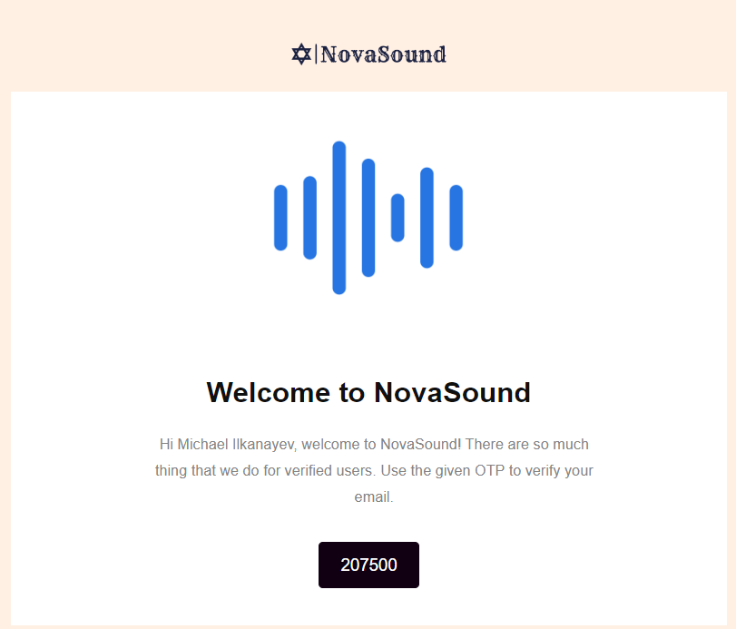
  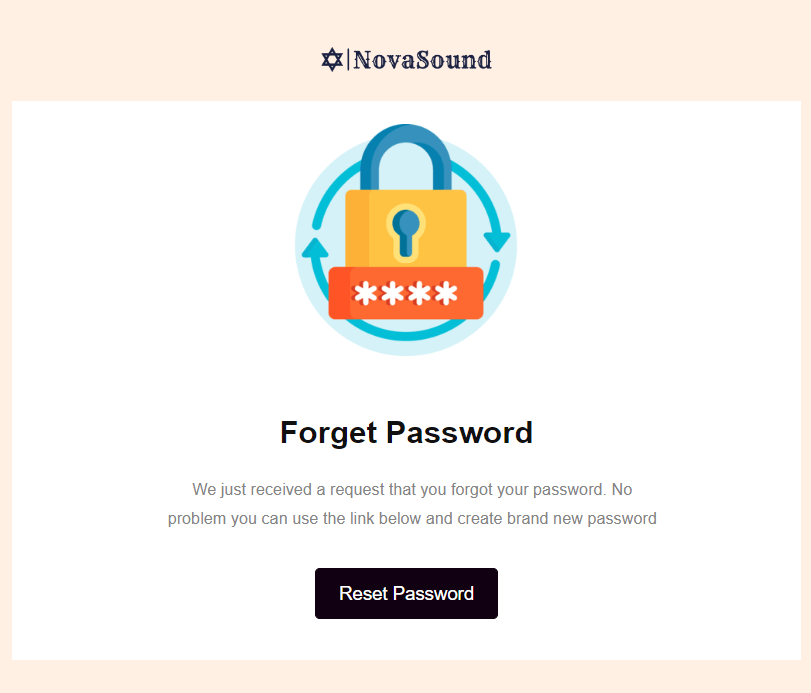

 

## License :

*This project is licensed under the [MIT License](LICENSE).*

